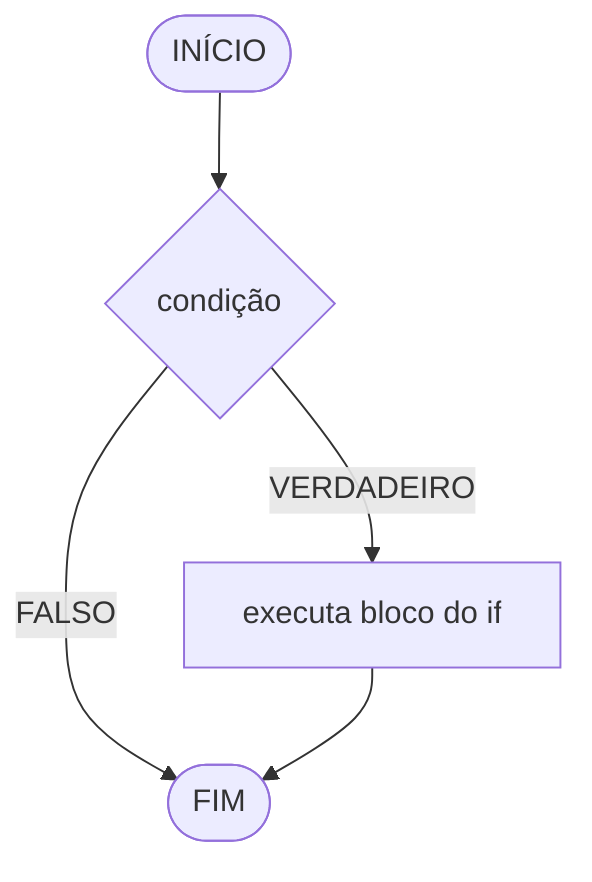
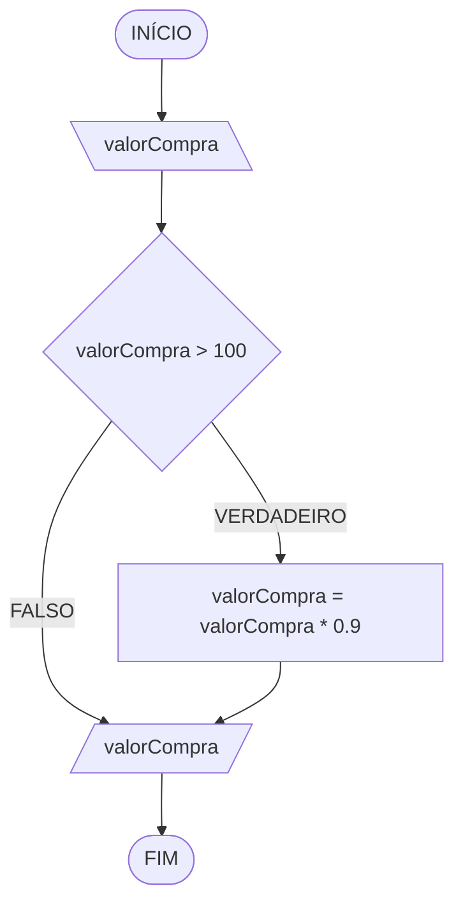
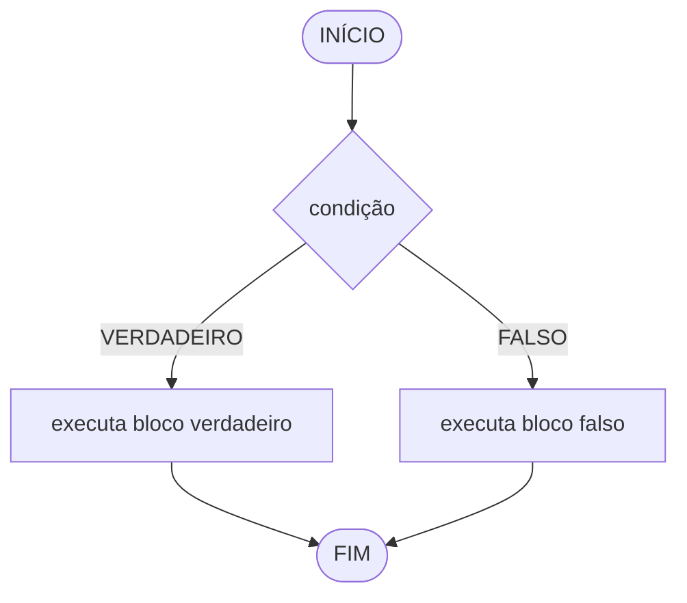
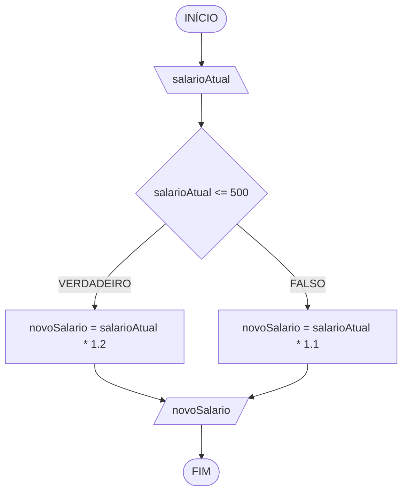
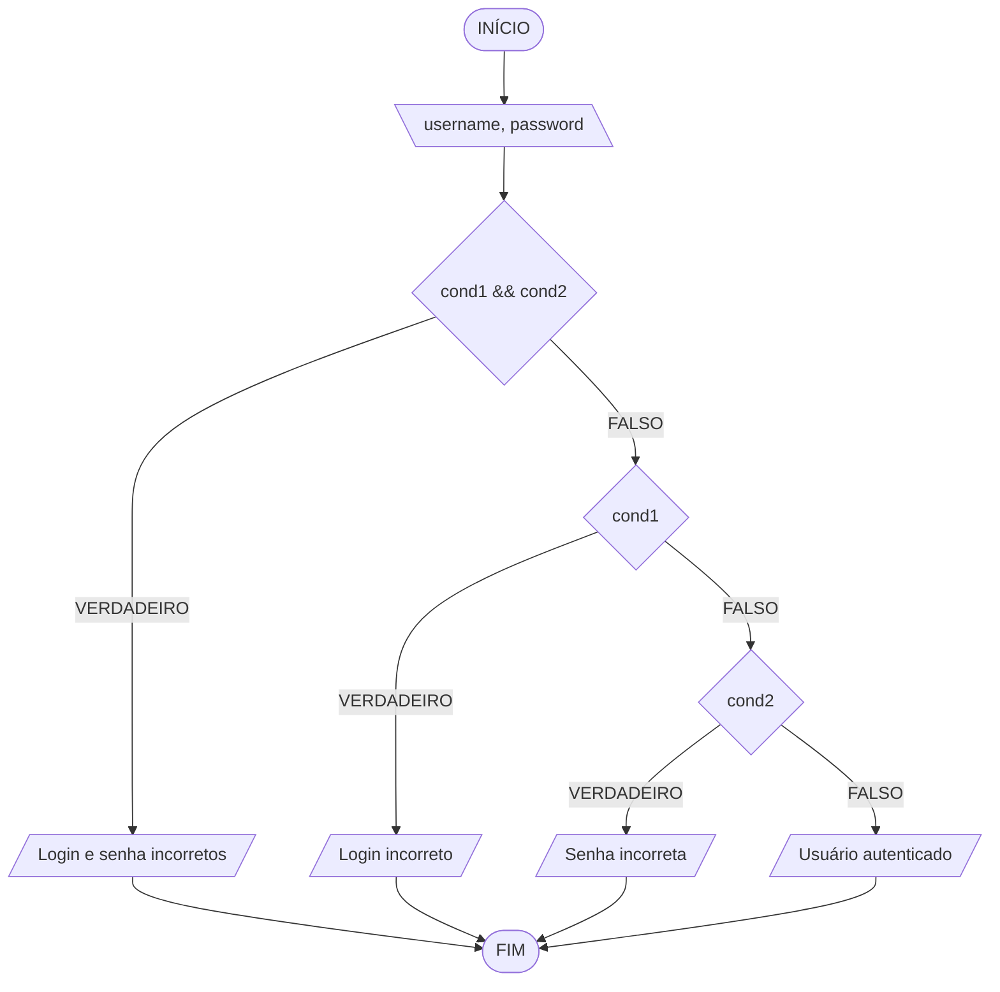

### 1. Controle de fluxo
Em algoritmos, o fluxo de execução pode seguir três formas principais:
- **sequencial**: executa instruções em ordem, sem desvios;
- **condicional**: escolhe caminhos diferentes conforme uma condição;
- **repetição**: repete um bloco de instruções enquanto uma condição for atendida.


### 2. Condição lógica
Uma condição é uma expressão que resulta em:
- `true` (verdadeiro), ou
- `false` (falso).

Exemplos:
- `idade >= 18`
- `nota >= 6`
- `(media >= 5) && (frequencia >= 75)`

### 3. Estrutura condicional simples (`if`)
Usada quando existe ação apenas para o caso verdadeiro.

Sintaxe:
```js
if (condicao) {
  // executa se condicao for true
}
```

Fluxograma (Mermaid):


Exemplo prático 1:
```js
// Entrada (sempre chega como texto)
let valorCompra = prompt("Digite o valor da compra:");

// Conversão para número decimal
valorCompra = parseFloat(valorCompra);

// Regra: aplica desconto apenas acima de 100
if (valorCompra > 100) {
  valorCompra = valorCompra * 0.9; // desconto de 10%
}

// Saída final
console.log(`Valor final: ${valorCompra}`);
```

Fluxograma (Mermaid):


Teste de mesa:

| valorCompra | valorCompra > 100 | saída |
| ---         | ---                | ---   |
| 150         | V                  | 135   |
| 100         | F                  | 100   |
| -80         | F                  | -80   |

> **Observação:** o algoritmo não valida valores negativos — `-80` passa direto sem desconto, mas continua sendo um valor de compra sem sentido no mundo real. Vale como gancho para a próxima aula, sobre validação de entrada.

### 4. Estrutura condicional composta (`if...else`)
Usada quando há ação para o caso verdadeiro e para o caso falso.

Sintaxe:
```js
if (condicao) {
  // bloco verdadeiro
} else {
  // bloco falso
}
```

Fluxograma (Mermaid):


Exemplo prático 2:
```js
// Entrada
let salarioAtual = prompt("Digite o salário atual:");

// Conversão para número decimal
salarioAtual = parseFloat(salarioAtual);
let novoSalario;

// Regra de negócio por faixa salarial
if (salarioAtual <= 500) {
  novoSalario = salarioAtual * 1.2;
} else {
  novoSalario = salarioAtual * 1.1;
}

// Saída formatada com 2 casas decimais
console.log(`Novo salário: R$ ${novoSalario.toFixed(2)}`);
```

Fluxograma (Mermaid):


Teste de mesa:

| salarioAtual | salarioAtual <= 500 | saída |
| ---          | ---                  | ---   |
| 450          | V                    | 540   |
| 500          | V                    | 600   |
| 800          | F                    | 880   |

### 5. Estrutura condicional encadeada (`if...else if...else`)
Usada quando existem mais de duas possibilidades de decisão.

Sintaxe:
```js
if (condicao1) {
  // bloco 1
} else if (condicao2) {
  // bloco 2
} else {
  // bloco final (caso nenhuma condicao anterior seja verdadeira)
}
```

Exemplo prático: autenticação de usuário

```js
// Entrada de credenciais
const username = prompt("Digite o usuário:");
let password = prompt("Digite a senha numérica:");

// Conversão da senha para inteiro
password = parseInt(password);

// Regras de autenticação
if (username !== "usuario123" && password !== 123456) {
    console.log("Login e senha incorretos");
} else if (username !== "usuario123") {
    console.log("Login incorreto");
} else if (password !== 123456) {
    console.log("Senha incorreta");
} else {
    console.log("Usuário autenticado");
}
```

> Usamos `!==` (diferente estrito) em vez de `!=`, para evitar comparações com conversão automática de tipo — mesma prática que já seguimos com `===` no restante da aula.

Fluxograma (Mermaid):

`cond1 = username !== "usuario123"`
`cond2 = password !== 123456`



Teste de mesa:

| username   | password | cond1 && cond2 | cond1 | cond2 | saída |
| ---        | ---      | ---             | ---   | ---   | ---   |
| usuario123 | 123456   | F               | F     | F     | Usuário autenticado |
| usuario123 | 999999   | F               | F     | V     | Senha incorreta |
| admin      | 123456   | F               | V     | F     | Login incorreto |
| admin      | 999999   | V               | V     | V     | Login e senha incorretos |

### 6. Operador ternário
Forma resumida para decisões simples em uma linha.

Sintaxe:
```js
condicao ? valorSeVerdadeiro : valorSeFalso;
```

Exemplo prático 3:
```js
// Entrada
let numero = prompt("Digite um número inteiro:");

// Conversão para inteiro
numero = parseInt(numero);

// Regra: resto 0 na divisão por 2 indica número par
const resultado = (numero % 2 === 0) ? "Par" : "Ímpar";

// Saída
console.log(`O número é ${resultado}`);
```

### 7. Fechamento
Nesta aula, vimos como:
1. usar condições lógicas para controlar o fluxo de execução;
2. aplicar `if` em decisões simples;
3. aplicar `if...else` quando há dois caminhos possíveis;
4. aplicar `if...else if...else` em regras com várias faixas;
5. organizar condições com `cond1`, `cond2` (e outras) para facilitar fluxograma e teste de mesa;
6. resolver casos práticos de autenticação e classificação por intervalo de valores;
7. usar operador ternário em situações curtas e objetivas.

Esses conceitos formam a base para modelar regras de negócio em algoritmos e implementar validações com clareza antes de programar.

### Saiba mais
- MDN - `console.log()`: https://developer.mozilla.org/pt-BR/docs/Web/API/console/log_static
- MDN - `Number.prototype.toFixed()`: https://developer.mozilla.org/pt-BR/docs/Web/JavaScript/Reference/Global_Objects/Number/toFixed
- MDN - `prompt()`: https://developer.mozilla.org/pt-BR/docs/Web/API/Window/prompt
- MDN - `parseInt()`: https://developer.mozilla.org/pt-BR/docs/Web/JavaScript/Reference/Global_Objects/parseInt
- MDN - `parseFloat()`: https://developer.mozilla.org/pt-BR/docs/Web/JavaScript/Reference/Global_Objects/parseFloat
- MDN - if...else: https://developer.mozilla.org/pt-BR/docs/Web/JavaScript/Reference/Statements/if...else
- MDN - else if: https://developer.mozilla.org/pt-BR/docs/Web/JavaScript/Reference/Statements/if...else#usando_else_if
- MDN - Operador condicional (ternário): https://developer.mozilla.org/pt-BR/docs/Web/JavaScript/Reference/Operators/Conditional_operator
